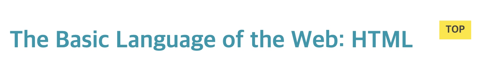

# CSS Fundamentals

## 1) WHAT IS CSS?

-   Cascading Style Sheets
-   CSS describes the visual style and presentation of the content writter in HTML
-   CSS consists of countless properties that developers use to format the content: properties about font, text, spacing, layout, etc.

<br><br>

## 2) Inline, Internal, and External CSS

### (1) Inline Style

-   인라인 스타일은 절대 사용하지 않는다.

<br>

```javascript
<h1 style="color: blue">📘 The Code Magazine</h1>
```

<br>

### (2) Internal Style

-   좋은 방법이 아니다.

```html
<!DOCTYPE html>
<html lang="en">
    <head>
        <meta charset="UTF-8" />
        <title>The Basic Language of the Web: HTML</title>

        <style>
            h1 {
                color: blue;
            }
        </style>
    </head>
</html>
```

<br>

### (3) External Style

-   css 파일에 css 코드를 넣어서 분리한다.

```html
<!DOCTYPE html>
<html lang="en">
    <head>
        <meta charset="UTF-8" />
        <title>The Basic Language of the Web: HTML</title>
        <link rel="stylesheet" href="style.css" />
    </head>
</html>
```

<br><bR>

## 3) Style Text

-   font-size
-   font-family
-   text-transform
-   font-style
-   line-height: 1.5 -> 높이가 글꼴의 1.5배가 된다는 의미

-   \<h1\>이 제일 주요한 제목이라고 해도 \<h2\>보다 커야 한다는 것은 아니다.

<br><br>

## 4) Combining Selectors

-   footer 태그 하위에 있는 모든 p 태그를 선택

<br>

```css
footer p {
}
```

<br><br>

## 5) Class and Id Selectors

-   id selector는 중복해서 사용할 수 없다. 하나의 요소에 하나의 id만 사용해야 함

<br>

```css
#author {
    font-style: italic;
    font-size: 18px;
}

#copyright {
    font-size: 16px;
}
```

<br>

-   따라서 이름을 재사용해야 한다면 클래스를 사용한다.
-   보통은 확장성을 위해 id를 사용하지 않고 항상 클래스를 사용한다.

<br>

```css
.related-author {
    font-size: 18px;
    font-weight: bold;
}

.related {
    list-style: none;
}
```

<br><br>

## 6) Working with Colors

### (1) RGB

-   Every color can be represented by a combination of RED, GREEN, and BLUE
-   Each of the 3 bas colors can take a value between 0 and 255, which leads to 16.8 million different colors

<br>

### (2) Defining Colors in CSS

-   RGB / RGBA Notation

    -   Regular RGB Model : rgb(0, 255, 255), rgb(244, 179, 63)
    -   RGB with transparency ("alpha") : rgba(0, 255, 255, 0.3), rgba(244, 179, 63, 0.7)

-   HEXADECIMAL Notation
    -   Instead of using a scale from 0 to 255, we go from 0 to ff (255 in hexadecimal numbers)
    -   #00ffff, #0ff
    -   In practice, we mostly use **hexadecimal** colors, and **rgba** when we need transparency

<br>

### (3) Shades of GREY

-   When colors in all 3 channels are the same, we get a grey color.
-   There are 256 pure grays to choose from
-   RGB 모델에서 세 개의 채널에 있는 세가지 색의 값이 똑같으면 회색이 된다. 모든 값이 0일 때는 완전히 검게 나오고 (rgb(0,0,0), #000000, #000) 모든 값이 최대값인 255나 ff일 경우 흰색으로 나온다. (rgb(255, 255, 255), #ffffff, #fff)
-   그래서 정확하게 256가지 회색이 있다.

<br>

```css
.main-header {
    background-color: #f7f7f7;
}

aside {
    background-color: #f7f7f7;
    border-top: 5px solid #1098ad;
    border-bottom: 5px solid #1098ad;
}
```

<br><br>

## 7) Pseudo-Classes

```css
li:first-child {
    font-weight: bold;
}
li:last-child {
    font-style: italic;
}
li:nth-child(even) {
    /* color: red; */
}

article p:last-child {
    color: red;
}
```

<br><br>

## 8) Styling Hyperliks

```css
a:link {
    color: #1098ad;
    text-decoration: none;
}
/* 이미 방문한 사이트의 링크일 때 */
a:visited {
    /* color: #777; */
    text-decoration: none;
}
/* 마우스 hover 시 */
a:hover {
    color: orangered;
    font-weight: bold;
    text-decoration: underline orangered;
}
/* 링크 클릭 시 */
a:active {
    background-color: black;
    font-style: italic;
}
```

<br><br>

## 9) CSS THEORY #1: Conflicts Between Selectors

-   Css selector 우선 순위는 다음과 같다.

-   !important > inline style > ID(#) selector > Class(.) or pseudo-code(:) selector > Element selector(p, div, li..) > Universal selector(\*)

<br>

```html
<footer>
    <p id="copyright" class="copyright text">
        Copyright &copy; 2027 by The Code Magazine.
    </p>
</footer>
```

<br>

```css
/* Resolving conflicts */
#copyright {
    color: red;
}

.copyright {
    color: blue;
}

.text {
    color: yellow;
}

footer p {
    color: green;
}
```

-   그러므로 footer 하위의 p의 color는 red가 된다.
-   .copyright text 클래스 selector는 적용되는 마지막 selector의 css가 적용된다. 그러므로 text 클래스의 color가 copyright color 값을 override 한다.

<br>

-   pseudo-code selector가 element selector보다 우선순위가 높으므로 아래 a 태그 selector 스타일은 적용되지 않는다.

<br>

```css
a:link {
    color: #1098ad;
    text-decoration: none;
}
/* 이미 방문한 사이트의 링크일 때 */
a:visited {
    /* color: #777; */
    text-decoration: none;
}
/* 마우스 hover 시 */
a:hover {
    color: orangered;
    font-weight: bold;
    text-decoration: underline orangered;
}
/* 링크 클릭 시 */
a:active {
    background-color: black;
    font-style: italic;
}

a {
    color: red;
}
```

<br>

-   !important 키워드는 사실 상 사용하지 말아야 할 hack에 가깝다. 아래 코드는 footer 하위의 p 태그 컬러가 초록색으로 바뀐다.

<br>

```css
#copyright {
    color: red;
}

.copyright {
    color: blue;
}

.text {
    color: yellow;
}

footer p {
    color: green !important;
}
```

<br><br>

## 10) CSS THEORY #2: Inheritance and the universal selector

-   기본적으로 상속이란 어떤 속성의 값을 부모 요소에서 자식 요소로 물려받는 것을 말한다.
-   Not all properties get inherited. It's mostly ones **related to text**: font-family, font-size, font-weight, font-style, color, line-height, letter-spacing, text-align. text-transform. text-shadow, list-style, etc

-   아래 예제에서 border-top 속성은 상속되지 않는다.

<br>

```css
body {
    color: #444;
    font-size: 16px;
    font-family: sans-serif;
    border-top: 10px solid #1098ad;
}
```

<br>

-   body에서 정의된 스타일 속성은 h1 스타일에 의해 color, font-size 속성이 재정의된다.

<br>

```css
h1 {
    color: #1098ad;
    font-size: 32px;
    text-transform: uppercase;
}
```

<br>

-   \*(universal selector)는 페이지의 모든 요소를 선택할 때 사용한다. 모든 요소에 속성이 적용되길 원하지만 그 속성이 상속되지 않을 때 유용하다.
-   universal selector는 가장 낮은 우선순위를 갖는다.
-   위에서 상속되지 않았던 border-top 속성도 모든 요소에 적용시킬 수 있다.

<br>

```css
* {
    border-top: 10px solid #1098ad;
}
```

<br>

-   그러므로 universal selector는 모든 요소에 적용되고 상속이 존재하지 않는다. 따라서 모든 요소에 상속되지 않은 특정 속성을 적용하고 싶을 때 유용하다. 반면 body에 스타일 속성을 넣으면 상속할 수 있다.

<br><br>

## 11) CSS THEORY #3: THE CSS BOX MODEL

### (1) THE CSS BOX MODEL

-   **Content**: Text, images, etc.
-   **Border**: A line around the element, still **inside** of the element.
-   **Padding**: Invisible space around the content, **inside**of the element
-   **Margin**: Space **outside** of the element, between elements.
-   **Fill area: Area that gets filled with **background color** or **background image\*\*

<br>

### (2) ELEMENT HEIGHT AND WIDTH CALCULATION

-   **Final element Width** = left border + left padding + width + right padding + right border
-   **Final element height** = top border + top padding + height + bottom padding + bottom border

-   This is the default behavior, but we can change it.

<br><br>

## 12) USING MARGINS AND PADDINGS

-   global css reset

<br>

```css
* {
    /* border-top: 10px solid #1098ad; */
    margin: 0;
    padding: 0;
}
```

<br>

-   Collapsing margins(마진 상쇄) : 같은 공간을 차지하는 margin이 2개일 때 둘 중 하나만 페이지에 보인다. 보통 둘 중 더 큰 쪽이 보인다.
-   https://github.com/yoojh9/udemy-css-basics/commit/c5c72f6496e33933a90060e34ae1540ae0d4d900

<br><br>

## 13) ADDING DIMENSIONS

-   100%는 parent container 너비 기준이다.
-   https://github.com/yoojh9/udemy-css-basics/commit/414cc5c6729782678f91eeb09dae0eea0f9c4fd0

<br>

```css
.post-img {
    width: 100%;
    height: auto;
}
```

<br><br>

## 14) CENTERING OUR PAGE

-   child element는 parent element보다 커질 수 없다.

<br>

```css
.container {
    width: 700px;
    margin-left: auto;
    margin-right: auto;
}
```

<br>

-   width를 지정하고 margin-left와 margin-right를 auto로 주게 되면 왼쪽과 오른쪽 margin이 같아야 하고 브라우저에서 자동으로 마진을 계산한다. 그렇기 때문에 왼쪽와 오른쪽에 똑같은 크기의 margin이 생기게 되고 그 결과 컨테이너가 body 중앙에 오게 된다.
-   auto란 의미를 브라우저가 자동으로 계산한다는 뜻이다.
-   https://github.com/yoojh9/udemy-css-basics/commit/51718411ad56e1045a33185550501edb42d7f927

<br><br>

## 15) CSS THEORY #4: TYPES OF BOXES

-   \<strong\>, \<a\>, \ 등의 태그는 전체 너비가 아니라 컨텐츠 너비만큼 공간을 차지한다. 이것을 인라인 박스라고 한다.
-   \<p\>, \<h3\> 처럼 전체 너비 영역을 차지하는 요소를 블록 레벨 박스 또는 블록 레벨 요소라고 부른다. 대부분의 요소는 블록 레벨 박스이다.
-   즉 블록 레벨 박스는 공간을 최대한 차지하고 그 뒤에 line break를 만든다. 다시 말해 다른 요소와 나란히 있을 수 없다.

<br>

### (1) BLOCK-LEVEL BOXES

-   Elements are formatted visually as **blocks**
-   Elements occupy **100% of parent element's width**, no matter the content.
-   Elements are **stacked vertically** by default, one after anther.
-   The box-model **applies as showed** earlier

<br>

```
default elements: body, main, header
    footer, section, nav, aside, div, h1-h6,
    p, ul, ol, li, etc.

// 아래 css로 inline-box -> block-box 로 변경할 수 있음
With CSS: display: block
```

<br>

### (2) INLINE BOXES

-   Occupies only the space **necessary for its content**
-   Causes **no line-breaks** after or before the element
-   Box model applies in a different way: **height and widths do not apply**
-   **Paddings and margins** are applied **only horizontally** (left and right)

<br>

```
default elements: a, img, strong, em, button, etc.

// 아래 css로 block-box -> inline-box 로 변경할 수 있음
With CSS: display: inline
```

<br>

### (3) INLINE-BLOCK BOXES

-   Looks like inline from the **outside**, behaves like block-level on the **inside**
-   Occupies only content's space
-   Cause no line-breaks
-   Box-modle applies as showed (height, width 설정 가능, padding, margin 가능)

<br>

```css
display: inline-block;
```

<br>

-   \는 실제로 inline-block처럼 처리된다.
-   아래 코드는 상하좌우에 margin이 적용된다. width와 height을 설정할 수 있던 것도 inline-block이기 때문에 가능하다.

<br>

```css
.post-img {
    width: 100%;
    height: auto;
    margin: 100px;
}
```

<br><br>

## 16) CSS THEORY #5: ABSOLUTE POSITIONING

### (1) Normal Flow

-   Default positioning
-   Element is "in flow"
-   Element are simply laid out according to their order in the HTML code

<br>

```
Default Positioning

position: relative
```

<br>

### (2) Absolute Positioning

-   Element is removed from the normal flow: "out of flow"
-   No impact on surrounding elements, might over them
-   we use top, bottom, left, or right to offset the element from its relatively positioned container

<br>

```
position: absolute
```

<br>

```css
button {
    font-size: 22px;
    padding: 20px;
    cursor: pointer;
    position: absolute;
    bottom: 50px;
    right: 50px;
}
```

-   위 css는 default로 브라우저 viewport 기준(브라우저에서 페이지를 볼 수 있는 부분)으로 위치를 잡는다. 때문에 스크롤되는 페이지 하단에 버튼이 보여지는게 아니라 현재 보여지는 페이지 기준으로 버튼이 보여진다.
-   스크롤 했을 때 가장 하단 영역에 버튼이 보여지게 하려면 parent 요소를 position: relative로 두고, parent 요소 기준으로 위치를 설정할 수 있다.
-   parent 요소는 position: relative로 설정된 parent 중 가장 가까운 요소 기준이다.

<br>

```css
body {
    color: #444;
    font-family: sans-serif;
    border-top: 10px solid #1098ad;
    position: relative;
}
```

<br>

-   위 속성을 복잡한 레이아웃을 만드는데 사용하지 말고 버튼처럼 작은 단일 요소에 대해서만 absolute를 사용한다.
-   https://github.com/yoojh9/udemy-css-basics/commit/6c5fb9388cc8f622f50544452d514e55de0b4021

<br><br>

## 17) PSEUDO-ELEMENTS

-   pseudo class와는 별개이다.
-   아래 css는 h1의 첫번째 글자를 의미한다.

<br>

```css
h1::first-letter {
    font-style: normal;
    margin-right: 5px;
}
```

<br>

-   \+ 기호는 sibling을 의미하며 아래 selector는 h3 요소 다음에 오는 sibling 요소인 p 요소의 첫번째 라인을 의미한다.

<br>

```css
h3 + p::first-line {
    color: red;
}
```

<br>

-   ::after 또는 ::before pseudo 코드를 이용해 html에는 없는 요소를 만들 수도 있다.

<br>

```css
h2 {
    position: relative;
}
/* pseudo element는 기본적으로 inline임 */
h2::after {
    content: "TOP";
    background-color: #ffe70e;
    color: #444;
    font-size: 16px;
    font-weight: bold;
    display: inline-block;
    padding: 5px 10px;
    position: absolute;
    top: -10px;
    right: -25px;
}
```

<br>

-   위 css는 아래 이미지처럼 보인다.



<br>

-   https://github.com/yoojh9/udemy-css-basics/commit/ed3718539af18b804a20b61c319ec4d2b038f931
