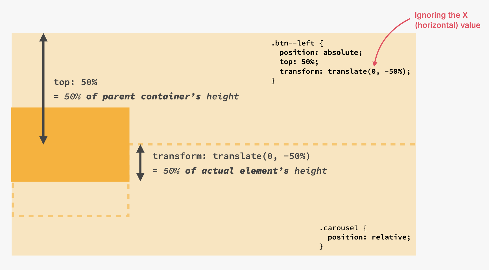

# Components and Layout Pattern

## 1) Elements and Components

### (1) From elements to Webpage

- Element -> Components -> Layouts -> Webpage
- Use common elements and components to convey your website's information
- Combine components into layouts using **common layout patterns**
- Assemble diffrent layout areas into a complete, final page

<br>

### (2) Elements

- Text
- Button
- Images
- Input elements
- Tags

<br>

### (3) Components

- Breadcrumbs (ex. Development > Web Development > Javascript)
- Pagination
- Alert and Status bar
- Statistics
- Gallery
- Feature box
- Preview and Profile card
- Accordion
- Tabs
- Carousel
- Customer Testimonials
- Customer Logos
- Steps
- Forms
- Tables
- Pricing Tables
- Modal Windows

<br><br>

## 2) Building an Accordion component

### (1) Switching Flex-Direction to Column

- Main Axis가 가로 방향에서 세로 방향으로 변함.
- with flex-direction set to **COLUMN :**
  - align-items aligns items **horizontally**, no longer vertically
  - justify-content aligns items **vertically**, no longer horizontally
  - gap acts like **margin-bottom**, no longer like margin-right

<br>

```css
.accordion {
  display: flex;
  gap: 24px;
  flex-direction: column;
}
```

<br>

- https://github.com/yoojh9/udemy-css-basics/commit/10c858f7ba4e884e4e69b23ff8a7cfbea04d9d39
- https://github.com/yoojh9/udemy-css-basics/commit/b3246b2251ec1c52c26fc902bd4bdc533f3987c8

<br><br>

## 3) Building a Carousel Component

- 아래 .btn 클래스는 position이 absolute이다. top, left는 relative한 부모 컨테이너 기준으로 이동한다. 아래 코드는 부모 element 기준으로 50% 내려가는 위치에 child element가 위치되므로 정확히 중간 위치가 아니다. 이때 child element의 절반 크기만큼 다시 위로 올려야 되는데 이때 사용한 것이 transform: translate(-50%, -50%)이다.
- 즉 trasform: translate(-50%, -50%)는 그 element 기준이다.

<br>



<br>

```css
/* CONTROLS */
.btn {
  background-color: #fff;
  border: none;
  height: 40px;
  width: 40px;
  position: absolute;
  box-shadow: 0 12px 24px rgba(0, 0, 0, 0.2);
  border-radius: 50%;
  display: flex;
  align-items: center;
  justify-content: center;
}
.btn--left {
  /* In relation to Parent Element */
  left: 0;
  top: 50%;
  /* In relation to Element ITSELF*/
  transform: translate(-50%, -50%);
}
```
